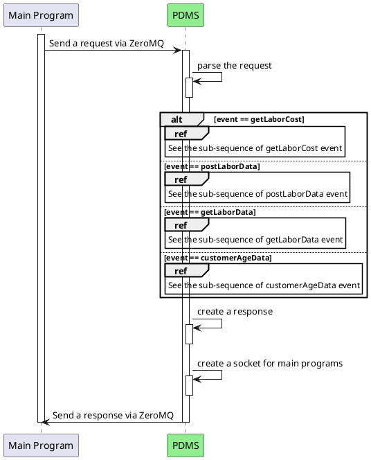
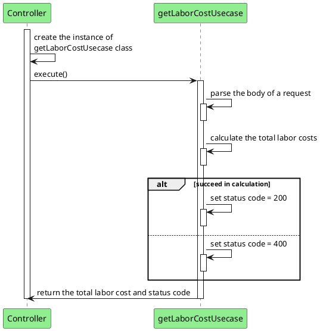
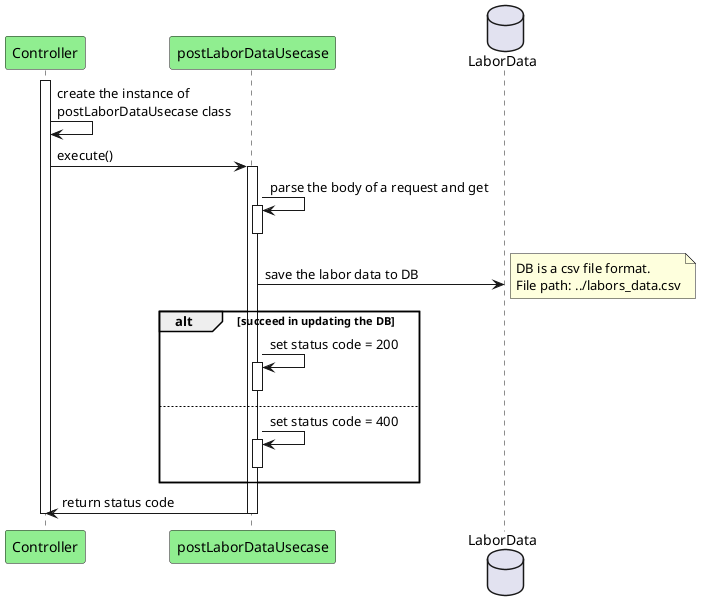
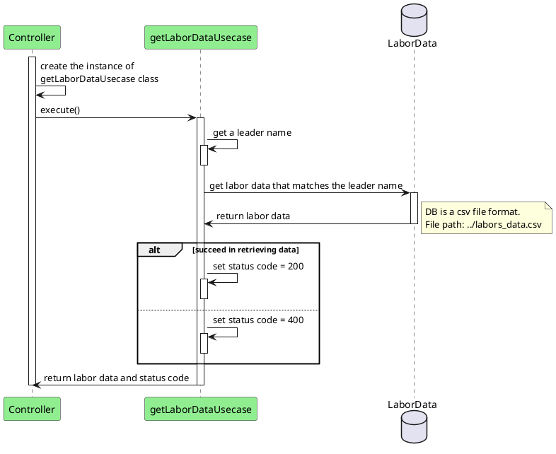
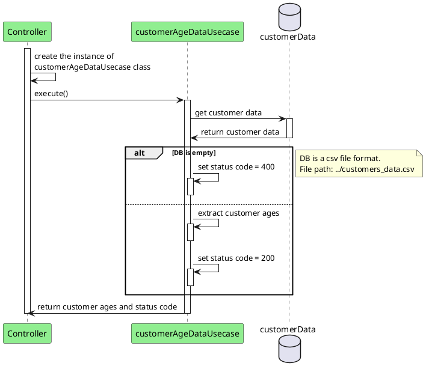

# Personal Data Management Service (PDMS) - Communication contracts

## Index

* [Specifications](#Specifications)
* [Sequence diagrams](#Sequences)
* [API Specifications](#API-specifications)

## Basic Information
* CS361, 2025 Winter term
* Developer name: Takafumi Suzuki

## How to use this service
Main programs can communicate with this service via <span style="color: red;">**ZeroMQ**</span> in the local environment.<br>
The port number of this service is <span style="color: red;">**#5555**</span>.

### 1.How to request data

To request data from this service, main programs must create requests in the specified format and a socket with the port number, then send it.<br>

Request Specification:

| Attribute | Meaning                                                                                         |
|-----------|-------------------------------------------------------------------------------------------------|
| request   | Top level attribute, which must include event and body attributes.                              |
| event     | The name of event used to invoke functions related to each user story.                          |
| body      | The data to be used in functions related to user stories. The value varies depending on events. |

Example:
```
{
    "request": {
        "event": "customerAgeData",
        "body": ""
    }
}
```

### 2.How to receive data

To retrieve data from this service, main programs must create a socket for receiving beforehand.<br>
After sending the request, your main program receive a response in the following format.<br>

Response Specification:

| Attribute | Meaning                                                                   |
|-----------|---------------------------------------------------------------------------|
| response  | Top level attribute, which must include event, body, and code attributes. |
| event     | The name of event used to invoke functions related to each user story.    |
| body      | The data returned from this service.                                      |
| code      | Response status. In the case of success, its value is 200, otherwise 400. |

Example:
```
{
    "response": {
        "event": "customerAgeData",
        "body": {
            "customerAge": ["18", "25", "33", "45"]
        },
        "code": "200"
    }
}
```

## Sequences
### Controller



### getLaborCost event


### postLaborData event


### getLaborData event


### customerAgeData event


## API-specifications
### getLaborCost event
#### request sample
```commandline
{
    "request": {
        "event": "getLaborData",
        "body": {
            "crewName": "Andrew"
        }
    }
}
```
#### response sample
```commandline
{
    "response": {
        "event": "getLaborData",
        "body": {
          "labor": {
            "Worker": ["5","20"],
            "CrewLead": ["1", "28"],
            "Supervisor": ["1","32"]
          }
        },
        "code": "200"
    }
}
```

### postLaborData event
#### request sample
```commandline
{
    "request": {
        "event": "postLaborData",
        "body": {
          "crewName": "Andrew",
          "labor": {
            "Worker": ["5","20"],
            "CrewLead": ["1", "28"],
            "Supervisor": ["1","32"]
          }
        }
    }
}
```
#### response sample
```commandline
{
    "response": {
        "event": "postLaborData",
        "body": "",
        "code": "200"
    }
}
```

### getLaborData event
#### request sample
```commandline
{
    "request": {
        "event": "getLaborData",
        "body": {
            "crewName": "Andrew"
        }
    }
}
```
#### response sample
```commandline
{
    "response": {
        "event": "getLaborData",
        "body": {
          "labor": {
            "Worker": ["5","20"],
            "CrewLead": ["1", "28"],
            "Supervisor": ["1","32"]
          }
        },
        "code": "200"
    }
}
```

### customerAgeData event
#### request sample
```commandline
{
    "request": {
        "event": "customerAgeData",
        "body": ""
    }
}
```
#### response sample
```commandline
{
    "response": {
        "event": "customerAgeData",
        "body": {
            "customerAge": ["18", "19", "18"]
        },
        "code": "200"
    }
}
```

